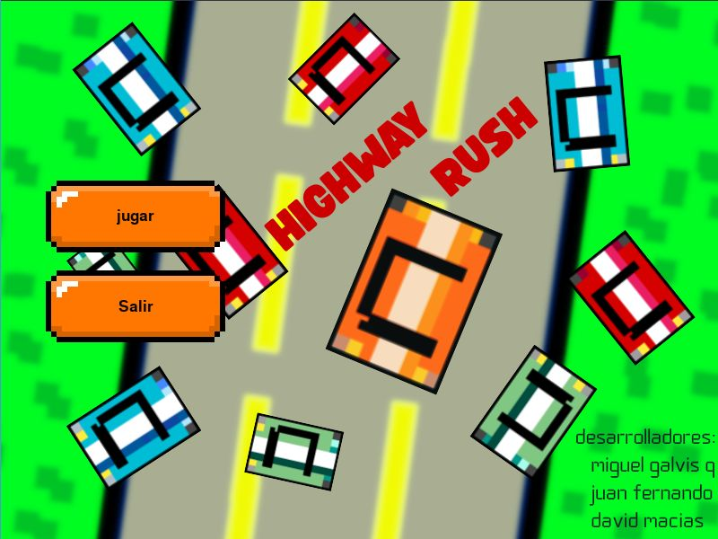
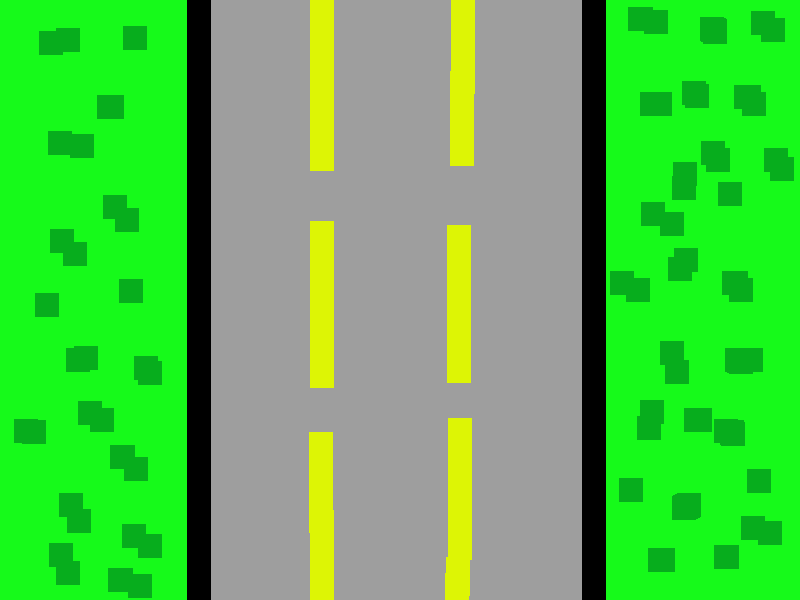
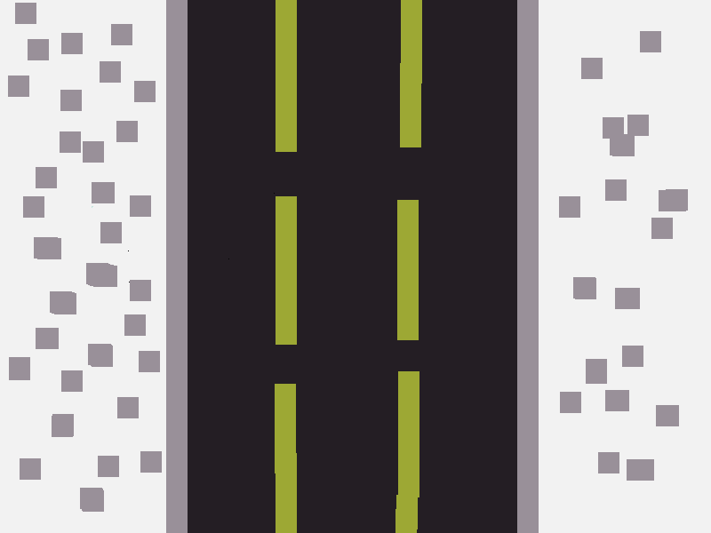
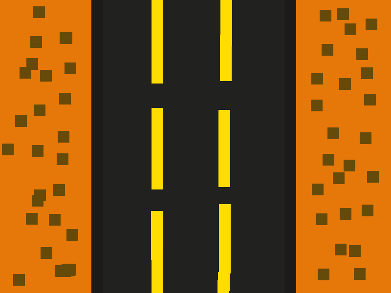

# highway rush
## Descripción del Juego: Highway Rush
Highway Rush es un juego tipo arcade de conducción vertical desarrollado en Python con Pygame, en el que el jugador debe esquivar autos en una autopista de múltiples carriles mientras acumula puntos por cada vehículo que rebasa. A medida que el jugador progresa, la dificultad aumenta con más velocidad y tráfico, ofreciendo una experiencia desafiante y divertida.

## Características del Juego
### Jugabilidad:
El jugador controla un carro que puede moverse izquierda y derecha usando las flechas del teclado.

El objetivo principal es evadir los autos del tráfico que se aproximan desde la parte superior de la pantalla.

Cada auto que el jugador evita cuenta como un auto rebasado, aumentando su puntaje.

### Niveles:
El juego está dividido en tres niveles.

Al completar un número determinado de autos rebasados por nivel, la velocidad del tráfico aumenta, subiendo la dificultad.

El entorno visual de la carretera cambia entre niveles para reflejar el progreso.

### Sonido:
El juego incluye efectos de sonido al rebasar autos.

Se reproduce una música de fondo continua, tanto en el menú como durante la partida.

La música se reinicia o detiene correctamente al pasar entre pantallas.

### Gráficos:
Se utilizan imágenes personalizadas para los carros, la carretera, el menú y los botones.

Los botones del menú están representados por imágenes con texto renderizado encima, mejorando la interfaz visual.

Las colisiones están bien implementadas usando pygame.sprite.Sprite.

### Condiciones de Juego:
Si el jugador colisiona con un auto, aparece una pantalla de "¡Perdiste!" con opción para volver al menú.

Si el jugador completa todos los niveles, aparece una pantalla de victoria.

También se puede salir del juego en cualquier momento desde botones dedicados.

### Técnicas Usadas
Uso de sprites y grupos (pygame.sprite.Group) para manejar tráfico y colisiones.

Separación de lógica en funciones como pantalla_nivel(), pantalla_victoria(), menu_juego() y juego().

Carga de recursos con os.path.join() para compatibilidad multiplataforma.

Cambio dinámico de dificultad y entorno según el nivel.

Manejo de eventos pygame con control del flujo de pantalla y música.

### Posibles Mejores Futuras
Agregar sistema de puntaje alto o récord.

Introducir obstáculos fijos o en movimiento.

Implementar vida extra o power-ups.

Incluir pantalla de pausa o controles configurables
## fotos del juego
### menu
 
### mapa nivel uno

### mapa nivel dos

### mapa nivel tres

### trafico

### jugador
